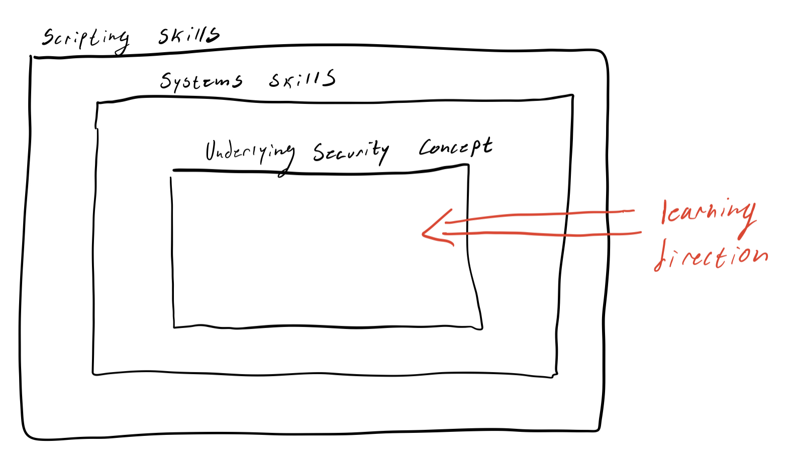

# Background

## The Education Gap
Over the course of my somewhat fruitful CTF career, I've picked up a lot of knowledge for getting started in hacking. I've read many "getting started" guides as well as helped create content for an automated framework to teach people how to pwn ([pwn.college](https://pwn.college)). Many of my CTFing peers learned through experience in CTF, but an even larger amount of people who used to be on our team did not. This goes to say, I think there is a small, but impactful, gap between having the ability to follow someone else's "curriculum" and creating one for yourself.

To cope with this education gap, the aforementioned [pwn.college](https://pwn.college) was created to help people get to the "yellow belt" level of hacking -- essentially having enough skill to create your own learning curriculum. The one issue is that the class assumes you have **junior year level computer science knowledge** (at Arizona State University). To clarify, that skill level assumes you know how to use Linux, understand C, how binaries work... and much more. For real noobs, like myself when I started hacking, we don't know any of those things yet. This handbook was created to fill that secondary gap. 

## The Target Audience

This handbook is targeted at anyone below the "junior in college" level of computer science, though even those individuals may find something useful from this handbook. This handbook is intended to give you all the material and direction you need to start pwn.college. After which, it is assumed you will continue your education with the pwn.college teaching platform. 

## The Handbook's Novelty

As I breifly mentioned [above](#the-education-gap), there exist many places to start practicing pwning and reversing, but not many that will explain the introductory concepts. As an example, taking a look at the [Nightmare Book's](https://guyinatuxedo.github.io/index.html) style of teaching. It is layed out into chapters of exploitation techniques, which I like a lot. Each section is a writeup of how to solve a challenge that has the exploitation technique embedded in it. I think this method is extremly effective for learning for those with pre-established skills in Linux, C, and systems. I think this method fails for noobs who are just learning how C really works (on the memory level). In my brain, *prepare for what animations look like in my brain*, the learning barriers look like this:

**Nightmare Method**:

**'Ike Method**:

The subtle difference here is that I believe the underlying security concept should be educated and learned about through explicit material first, then it should be reinforced with scripting and systems skills. This is not to say I don't like the Nightmare method, I love it, but others need a different one. This book is that different method. 