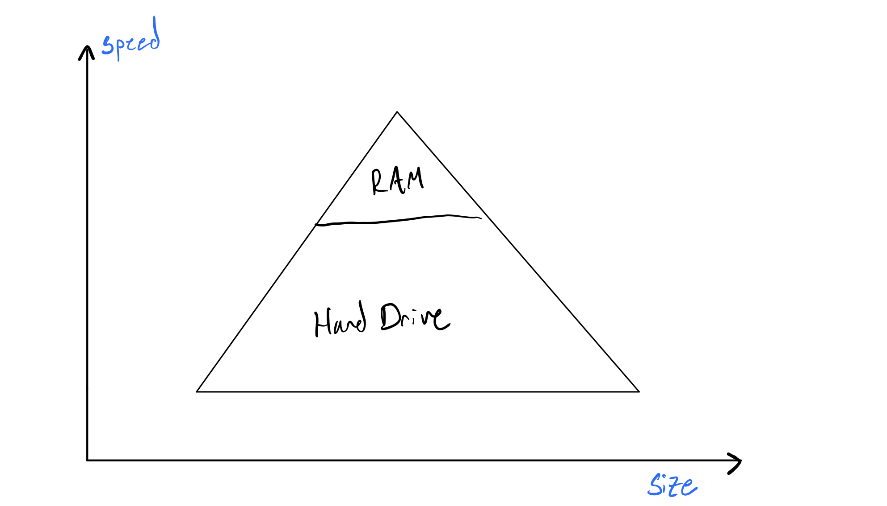

# Introduction

To cover computer organization is to cover what it means to *be a computer*. The way we organize the hardware dictates how our computer works. The organization of hardware in a particular form is called a [computer architecture](https://en.wikipedia.org/wiki/Computer_architecture).

## The Von Neumann Architecture

The von Neumann architecture is by far the most famous and well-known abstract computer architecture in computer science. Its principal belief is that our computer is a "pyramid" of memory units that get faster but smaller as we go up the stack. You put things you need faster in the higher level memories, and things you need slower and in larger quantities in the lower level memories: 

Abstractly, this is done because faster memory units are more expensive to make, and usually, we don't need faster memory for long. So what the hell is a faster memory unit? Let's revise the picture above:

Two commonly known memory units are your hard drive and your RAM. As you likely know, the RAM is much smaller than your hard drive, but somehow much more expensive. In a parallel fashion, your RAM is also much faster than your hard drive. From now on, let's refer to your RAM as [computer memory](https://www.computerhope.com/jargon/m/memory.htm). You probably have 8 Gigabytes of memory. Why is it so small? What is your computer memory actually used for? Why does it exist aside from your hard drive? The Von Neumann architecture dictates that it exists to put things we need more frequently or faster in. The special thing about your computer memory, though, is that it is volatile—meaning anything put in it is deleted when your computer restarts. 

Often the things we need in memory are programs, because we want those to run as fast as possible. Before we talk about putting programs in memory, we need to briefly talk about how we count in computers (yes, strange idea). Move on to the next reading.
