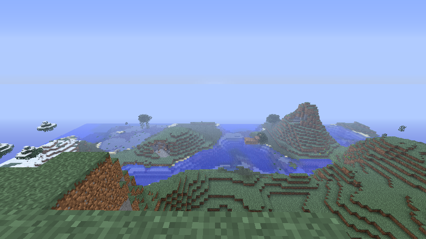

# Memory Segments

## Introduction 
In the last section, you learned that programs exist in memory. What you may not realize though is that we have segments, or divisions, of memory we a program is running. We call the addressing of these different memory segments a [memory map](https://en.wikipedia.org/wiki/Memory_map). Let's print the memory map of a process. Run the command below:

```bash
sleep 5 & cat "/proc/$!/maps"
```

This will run the `sleep` command (which sleeps for 5 seconds), and while it is running use the `pmap` command to print out the memory map of the process (which is the running memory instance of sleep). If you end up not being able to run this line, install pmap with `sudo apt-get install pmap -y`. Here is what the result should look similar to on your system:

```
[1] 243862
55ce021ae000-55ce021b0000 r--p 00000000 08:05 3540380                    /usr/bin/sleep
55ce021b0000-55ce021b4000 r-xp 00002000 08:05 3540380                    /usr/bin/sleep
55ce021b4000-55ce021b6000 r--p 00006000 08:05 3540380                    /usr/bin/sleep
55ce021b7000-55ce021b8000 r--p 00008000 08:05 3540380                    /usr/bin/sleep
55ce021b8000-55ce021b9000 rw-p 00009000 08:05 3540380                    /usr/bin/sleep
55ce03d2d000-55ce03d4e000 rw-p 00000000 00:00 0                          [heap]
7f4055792000-7f4055d02000 r--p 00000000 08:05 3545607                    /usr/lib/locale/locale-archive
7f4055d02000-7f4055d27000 r--p 00000000 08:05 3546309                    /usr/lib/x86_64-linux-gnu/libc-2.31.so
7f4055d27000-7f4055e9f000 r-xp 00025000 08:05 3546309                    /usr/lib/x86_64-linux-gnu/libc-2.31.so
7f4055e9f000-7f4055ee9000 r--p 0019d000 08:05 3546309                    /usr/lib/x86_64-linux-gnu/libc-2.31.so
7f4055ee9000-7f4055eea000 ---p 001e7000 08:05 3546309                    /usr/lib/x86_64-linux-gnu/libc-2.31.so
7f4055eea000-7f4055eed000 r--p 001e7000 08:05 3546309                    /usr/lib/x86_64-linux-gnu/libc-2.31.so
7f4055eed000-7f4055ef0000 rw-p 001ea000 08:05 3546309                    /usr/lib/x86_64-linux-gnu/libc-2.31.so
7f4055ef0000-7f4055ef6000 rw-p 00000000 00:00 0
7f4055f0a000-7f4055f0b000 r--p 00000000 08:05 3546044                    /usr/lib/x86_64-linux-gnu/ld-2.31.so
7f4055f0b000-7f4055f2e000 r-xp 00001000 08:05 3546044                    /usr/lib/x86_64-linux-gnu/ld-2.31.so
7f4055f2e000-7f4055f36000 r--p 00024000 08:05 3546044                    /usr/lib/x86_64-linux-gnu/ld-2.31.so
7f4055f37000-7f4055f38000 r--p 0002c000 08:05 3546044                    /usr/lib/x86_64-linux-gnu/ld-2.31.so
7f4055f38000-7f4055f39000 rw-p 0002d000 08:05 3546044                    /usr/lib/x86_64-linux-gnu/ld-2.31.so
7f4055f39000-7f4055f3a000 rw-p 00000000 00:00 0
7ffd0bc85000-7ffd0bca6000 rw-p 00000000 00:00 0                          [stack]
7ffd0bd80000-7ffd0bd83000 r--p 00000000 00:00 0                          [vvar]
7ffd0bd83000-7ffd0bd84000 r-xp 00000000 00:00 0                          [vdso]
ffffffffff600000-ffffffffff601000 --xp 00000000 00:00 0                  [vsyscall]
```

It's a lot of stuff, so let's break it down. The first column is the start address to end address of that memory region. The second column is the permissions. The fifth column is the size of that mapped data (as it stands right now). The sixth column is the name of that mapping, which is not required. 

> Note: it is common in computer science that if something does not have a name it is called "anonymous." Sometimes that name will be shorted to just "anon." 

I won't talk about the other columns because they aren't important for our example. 

## Important Maps
Using the output from the command above, we can make a little reduced table of the output:

| Address Range             | Permissions | Name           |
|---------------------------|-------------|----------------|
| 55ce021ae000-55ce021b0000 | r--p        | /usr/bin/sleep |
| 55ce021b8000-55ce021b9000 | rw-p        | /usr/bin/sleep |
| 55ce021b0000-55ce021b4000 | r-xp        | /usr/bin/sleep |
| 55ce03d2d000-55ce03d4e000 | rw-p        | heap           |
| 7ffd0bc85000-7ffd0bca6000 | rw-p        | stack          |

We will refer to these as maps 1 through 5. 

## Program Memory 
Maps 1, 2, and 3 refer to the memory of the program. This is a fundamental difference from the memory of the process that is running this program. We will talk about processes more in the [processes](../5_processes/indroduction.md) section, but for now you can consider a process to be a bunch of things mapped in memory along with the program. 

Back to our program mapped in memory. Maps 1, 2, and 3 are the memory with talked about in [programs-in-memory](./programs_in_mem.md) with the Minecraft example. You will notice that although all these mappings are for the same thing, they have different permissions per-split. 

Map 1 is a read-only section of the program. You could consider this to be the place in the program where unchangeable non-code things are stored. Things like constant strings, png's of Minecraft blocks, and stuff you will not modify while the program runs.

Map 2 is a read-write section of the program. You could consider this to be the place in the program where you can store and modify things. Things like names could be stored here. The username of your player in Minecraft may change while you play the game (you could change it at Mojang), which means this name is not constant and needs to be writeable. It could be stored here. Usually, these writeable sections in your program have a special name like `.data` or `.bss`.


Map 3 is a read-and-execute section of the program. In modern programs, this is the only mapping in the program that is executable. This is the place where the actual code of the program is stored. In Minecraft, this would be things like the logic for moving around your player, saving the world, placing blocks... everything. It's where the actual code that will be executed is stored. We will learn later that this is where instructions are stored. 

There are also more mappings in the program for other things, but you will notice that their permissions are all iterations of the maps we described above.

## Heap
The Heap is a section of memory in every process (the stuff mapped with the program) that is dedicated to being a large writeable space. You might be asking yourself: "Why does this need to exist? Why can't we just write everything in the writeable section of the program?" Let's continue to use Minecraft as our running example to answer this question. 

In Minecraft, as you roam around the world you may notice things coming in and out of view. The map, with all its AI and moving objects, is a large piece of data that is changing in memory all the time as you move. The amount that will be loaded in memory at any given time is completely unknown. You could, for instance, walk into a piece of the map where you built a 10000 chicken prison. That many chickens would absolutely destroy the program's memory if it could not _expand_. You could also turn up or down the render distance (the view distance), which would increase or decrease the amount of the map loaded at a given time.



To make things easy, we made a section of memory that is both large and expandable: the Heap! We put large things in the Heap because the Heap can get bigger or smaller as we need it. As a side note, when you need more space in the heap, the range of the end mapping gets bigger (expands up).

## Stack
The Stack is another section of memory in every process that is dedicated to being a medium-sized writeable space that is **very** fast. How fast? It can often be around [100x](https://publicwork.wordpress.com/2019/06/27/stack-allocation-vs-heap-allocation-performance-benchmark/) faster than using the heap, but it is also way less secure and has way less rules. For now, we will just ask you to believe us when we say the stack is much easier to corrupt than the heap, since you will learn that **very** technically if you finish this handbook and do the [memory errors](https://dojo.pwn.college/challenges/memory) module from pwn.college. 

So we have this faster less secure section of memory. We can't but everything there because it's insecure, but we can put small things that change often. In Minecraft, your username does not change _that frequently_, so it should not go here. When we say frequently, we mean a few dozen times in a second. 

Something that changes that frequently in Minecraft, but is pretty small, is the space in memory where we store the letters you type in the Multiplayer chat.


The chat constantly gets new letters that exist, then don't exist. For the chat history, we save that in the Heap. But for a single sentence you are about to send to the chat, we put in the Stack. It changes fast and needs that speed for players to get angry at their respective toasters. 


## Conclusion
There is a pattern among the usage of these writeable sections in memory:

| Name                    | Data changes | Date is Large | Data changes Often |
|-------------------------|--------------|---------------|--------------------|
| Writeable program space | X            |               |                    |
| Heap                    | X            | X             |                    |
| Stack                   | X            |               | X                  |

You use a program's writeable space when it's small and does not change much. Heap when it's large. Stack when it's small and rapidly changing. 

With everything you know now, this image of a processes memory should make sense:
```
*----*----*----*----*----* 0x0000000000000000
|                        |
|       MINECRAFT        |
|------------------------|
|                        |
|         HEAP           |
|                        |
|------------------------|
|          |             |
|          v             |
|                        |
|                        |
|          ^             |
|          |             |
|------------------------|
|         STACK          |
*----*----*----*----*----| 0xFFFFFFFFFFFFFFFF
```

When `Minecraft` is running, its program memory stays stationary. The Heap that it uses to store large changing things grows up (in addressing space) towards the Stack. The Stack that it uses to store small changing things grows down (in the addressing space) towards the Heap. All the other things you can see stored in memory in the initial maps we got are other programs that assist the main program while it runs. This can be things like external libraries (code others have written that you reuse).